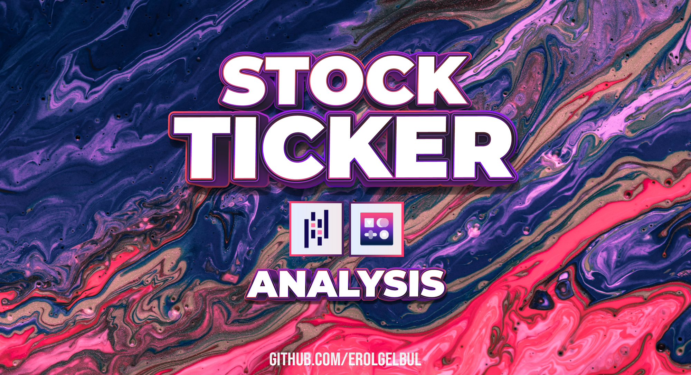
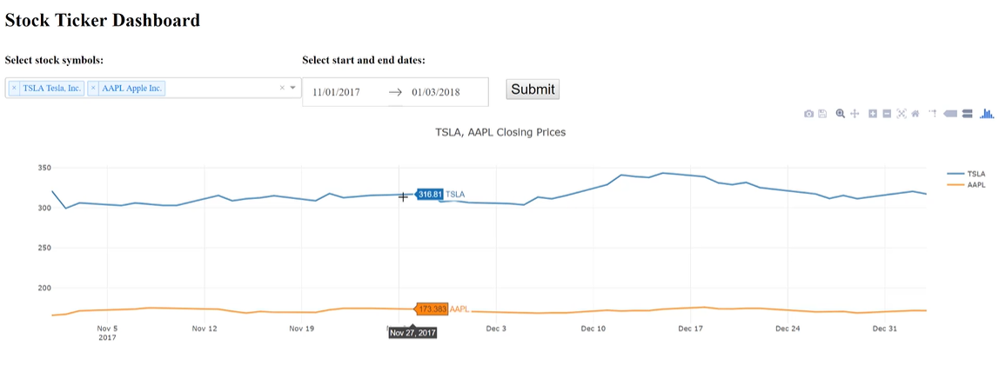

  

<!-- ABOUT THE PROJECT -->
## 1. Introduction

  

### 1.1 Libraries

- [Dash](https://plotly.com/dash/)
- [pandas](https://pandas.pydata.org/)
- [datareader](https://pandas-datareader.readthedocs.io/en/latest/)

<!-- CONTACT -->
## 2. Contact

Erol Gelbul - [Website](erolgelbul.com)

Project Link: [Stock Ticker](https://github.com/ErolGelbul/stock_ticker)

(<a href="#top">back to top</a>)
